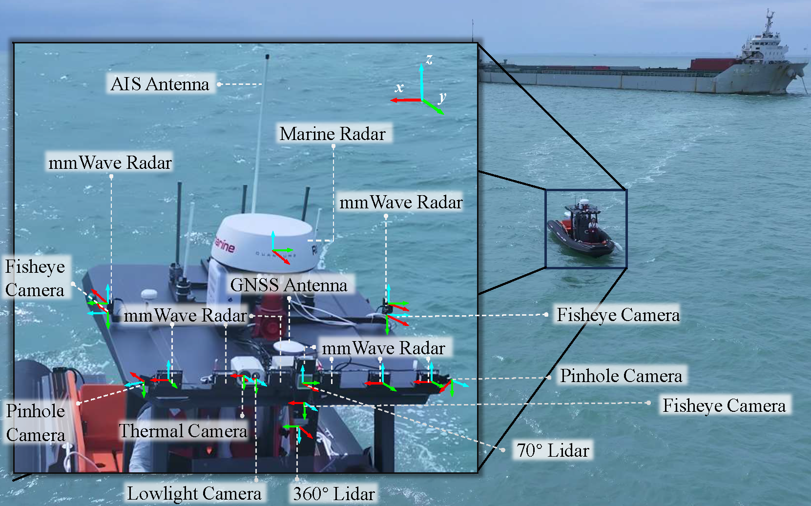
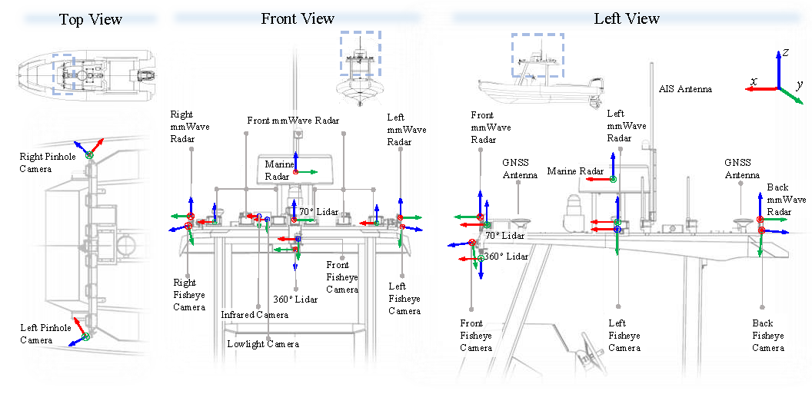

# MariSense: A Multimodal Dataset for Environmental Perception in Maritime Autonomy

## Overview

We present MariSense, a multi-modal dataset for maritime autonomy perception. MariSense is the first to introduce the concept of dynamic waveform 4D mmWave radar into maritime scenes, integrating multi-waveform radars with visible and thermal cameras, LiDAR, marine radar, Automatic Identification System (AIS), and navigation sensors, all with extrinsic calibration. The dataset covers various scenes such as anchorages and fairways under varying weather, time, and sea conditions. We establish benchmarks for object detection, tracking, and odometry, and evaluate baseline methods, highlighting the need for improved maritime perception, multi-modal fusion, and adaptive 4D mmWave radar waveform design.

## Data Acquisition Platform

The data acquisition platform is a rigid inflatable boat (RIB) with a length of 7.5 m, powered by a HONDA 150 engine, enabling a maximum speed of 25-30 knots. All sensors are mounted on the roof of the vessel.

<p align="center">
  
</p>
<p align="center">
  <em>The MariSense data acquisition platform</em>
</p>

<p align="center">
  
</p>
<p align="center">
  <em>Sensor configuration and mounting positions</em>
</p>

### Sensor Configuration

The platform is equipped with a comprehensive suite of sensors:

#### Visual Sensors

- **6 RGB Cameras**: Four fisheye cameras mounted around the vessel to record the surrounding environment, plus two pinhole cameras at the front with ~110° FOV for observing distant targets
- **1 Low-light RGB Camera**: Mounted at the bow for capturing images under poor lighting conditions
- **1 Thermal Camera**: Mounted at the bow for operation in challenging visibility conditions

#### LiDAR Sensors

- **Livox AVIA LiDAR**: Installed at the front with a detection range of 400 m
- **Livox MID360 LiDAR**: 360° LiDAR for capturing nearby scenes

#### Radar Systems

- **10 4D mmWave Radars**: Based on TI AWR2944 chip (77-81 GHz), configured in Doppler Division Multiple Access (DDMA) mode
  - One unit on each side (left, rear, right)
  - Seven units at the front with different waveform and parameter configurations
- **Raymarine Quantum 2 Radome Marine Radar**: Mounted on top for 360° surrounding data

#### Navigation Sensors

- **Dual GNSS System**: UBLOX-F9P chips in dual-chip, dual-antenna configuration
  - Achieves centimeter-level positioning accuracy with RTK near shore
  - Supports moving-base orientation
- **IMU**: TDK-Invensense IIM 46234 chip
- **AIS Receiver**: For maritime navigation and vessel identification

### Data Acquisition System

Two NVIDIA Jetson Orin NX 8G computing platforms connected via Ethernet and time-synchronized:

- **Platform 1**: Data reading, parsing, and publishing
- **Platform 2**: Data recording
- **Communication**: ROS2 framework

## Dataset Components

The MariSense dataset includes three main components:

1. **Object Detection** - Annotated data for detecting maritime objects
2. **Object Tracking** - Sequential data for tracking objects across frames
3. **Odometry** - Sensor data for visual and sensor-based odometry estimation

## Quick Links

- [Object Detection](docs/object-detection.md)
- [Object Tracking](docs/object-tracking.md)
- [Odometry](docs/odometry.md)
- [Development Tools](docs/development-tools.md)
- [Project Structure](docs/project-structure.md)

## Repository Structure

```
MariSense/
├── README.md                 # This file
├── LICENSE                   # Project license
├── CONTRIBUTING.md           # Contribution guidelines
├── requirements.txt          # Python dependencies
├── setup.py                  # Package installation script
├── .gitignore               # Git ignore rules
│
├── docs/                     # Detailed documentation
│   ├── object-detection.md   # Object detection task documentation
│   ├── object-tracking.md    # Object tracking task documentation
│   ├── odometry.md          # Odometry task documentation
│   ├── development-tools.md  # Tools and utilities guide
│   └── project-structure.md  # Complete project structure reference
│
├── src/                      # Source code
│   └── marisense/           # Main package
│       ├── __init__.py
│       ├── loaders/         # Data loaders
│       ├── visualization/   # Visualization tools
│       ├── evaluation/      # Evaluation metrics
│       ├── converters/      # Format converters
│       └── augmentation/    # Data augmentation
│
├── configs/                  # Configuration files
│   └── README.md
│
└── assets/                   # Media assets
    └── images/              # Platform images and diagrams
        ├── platform_real_pic.png
        └── platform_details.png
```

## Getting Started

[Content to be added]

## Dataset Download

[Content to be added]

## Citation

If you use the MariSense dataset in your research, please cite:

```bibtex
[Citation to be added]
```

## License

[License information to be added]

## Contact

[Contact information to be added]

## Acknowledgments

[Acknowledgments to be added]
